# **CCMG**

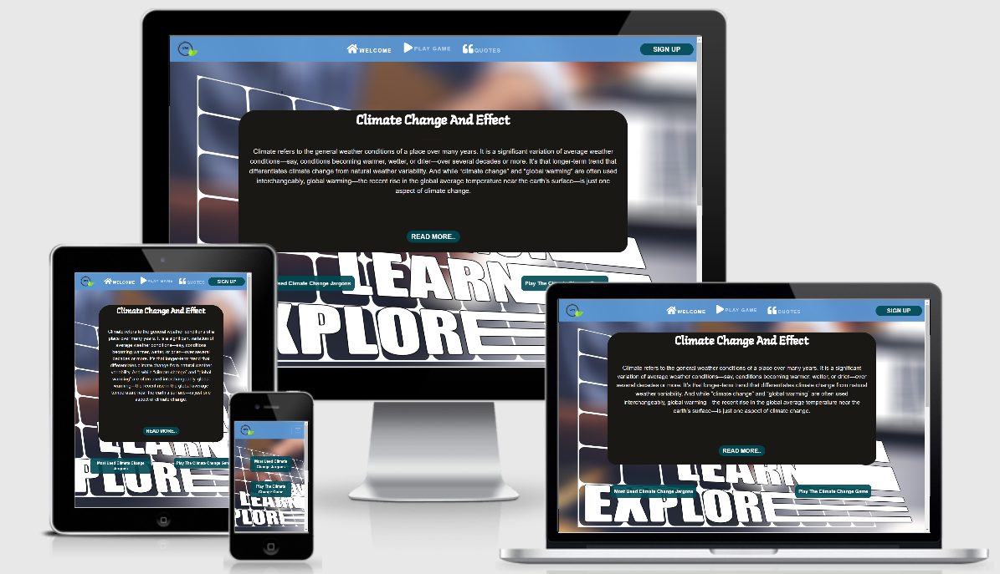
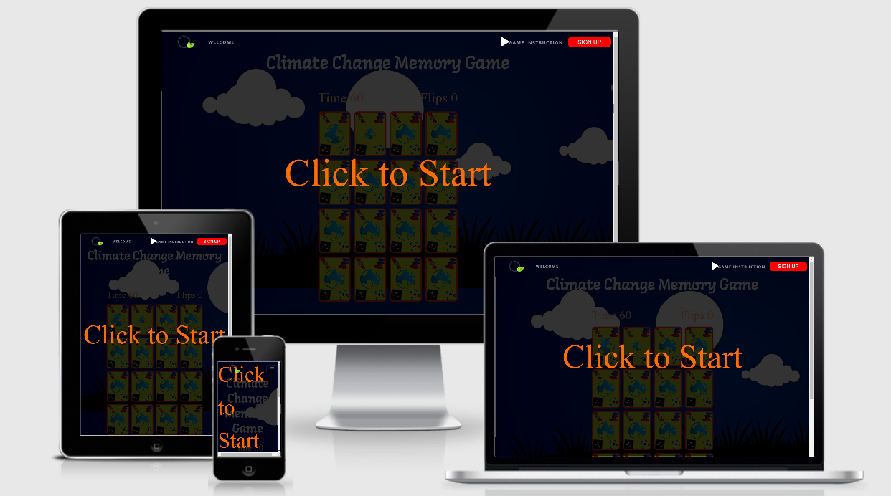

### **Website links:** 

*my github link*: [Rozdandy](https://github.com/Rozdandy?tab=repositories)

*Site*:[CCMG](https://rozdandy.github.io/ms2-project/.)

Climate Change Memory Game is pratically educative site, it is for those that care about the health of the planet earth. The goal is to provide an intuitive and interactive site which is user friendly to everyone in all ages and profession. The homepage provide an educating information on climate change which include some notable quotes of leaders across the world. While the game section is a memory game using cards whereby users are to match pairs. The cards are embossed with intriguing climate change related items and terms such as, GHG green house gases molecules, climate change impact, and mitigations pictures. Users will use their memory and skill to match the pairs before the time finishes.

# **UX (USER EXPERIENCE)**

## Project objectives

The website objective is mainly to sensitize the users on what climate change means, the effects it will have on users if human continued to pollute it, and also to educate them some main terminologies being used in the climate change parlance especially in conferences. At the same time the game section is not only played for the fun of it but to sublimianlly conscientised them on factors that could impacts the climate, what the climate will throw back at users when impacted and also the mitigation and adaptation concepts which are the various pictures that laden the back and the front of the cards. Also, the fun aspect is irrepresible which comes with soft background music while competing against the time.

## User Goals

* Play: a fun but less instructive interactive game one the site.
* Link: to the social media sites.
* Contact: to reach out to site owner.
* Sign up: to for more similar games and possible partnership.
* Welcome: read about climate change and their terms and effect.

## Ownership  Goals

* Build a good engaging and interactive website with real life Experience.
* To show good understanding of JavaScript and other technologies.
* To educate people sublimianlly through an interactive and engaging game.
* Build a site with game features that is easy to maintained and scaled and adapted by others.
* As a site developer, I want to develop an interactive website which user could play a game while learning, and sign up for more.
* As a site developer, I want to develop a site that is user friendly, responsive compactible with many devices including mobile ones.
* As a site owner, I want my users to be able to connect with the developer through social media platforms.
* As a site owner, I want to be able to showcase my skills and portfolio.
* As a site owner, I want my users to be able to learn more about climate change and be more concious of the impacts.

### User stories
 
* As a visiting user, I want to know the meaning of climate change.
* As a visiting user, I want to know the how climate change could impact humans and the ecosystem.
* As a visiting user, I would want to able to sign up with CCMG.
* As a visiting user, I would want to know some jargons use in the climate change parlance.
* As a visiting user, I would want to know the instructions on how to play thesite game.
* As a user, I want to know world leaders views on climate change. 
* As a user, I want to know where this organisation is located.
* As a user, I want to be able to link with site owner on Social Media platforms.
* As a user, I want to play readily start the game at a simple click without delay.
* As a visiting user, I want to see a game site that appeals to the sight, with good functionality.
* As a visiting user, I want to play with soft but not distracting background sound.
* As a visiting user, I want to play a game that is less instructive.
* As a user, I want a game that I can recommend to people easily including students.
* As a potential user, I want to play game that is fun at the same time educating.
* As a user, I would want to know the meaning of images at the back of cards and front of cards.
* As a visiting user, I want to hear the victory music when I won the game.
* As a visiting user, I want to hear the victory music when I won the game.
* As user, to want resounding indication like animations and sounds if I have a pair of cards matched
* As a user, I want to hear a music which is different from the victory sound if I failed to defeat the timer.
* As a user, i want to play a flipping card game to reveal the hidden images behind.
* As a user, I want to be able to view the countdown time that i am competing against which gives sense of challenge and mind engagement.
* As a user, I want to the number of flips it took me to win game game
* As a user, i want to be able to restart the at a click if I won or lost the game easily without much ado.
* As a user, I want to be able to click to sign up or contact the site owner or follow on social media without having to leave the page.

## Design Choices

The concept behind this site was borne from my love for the planet, on how better human can treat her so that this generation can bequeath her to the next generation. Also, the idea of building the game was inspired by a Youtube video [PortEXE](https://www.youtube.com/watch?v=3uuQ3g92oPQ) that I watched on how a Halloween card was built.  I therefore, thought of how to sensitize audience on climate change impact, mitigation and adaptation while at the same having fun.
I supposed the concept would be good for a memory games partly due to different images, colors and above all the subconcious learning part of it. I wanted a game site that will be highly interactive with quiet and less distractive music to go with the game.

#### Fonts

[Google Fonts!](https://fonts.google.com/) Two main fonts were used for the whole sites:

* Supermercado for the body with fall back on san serif.
* Langar for the headers with with fall back on san serif.

#### **Colour Scheme**

The developer used [eggradients](https://www.eggradients.com/shades-of-green-color) to choose colors that were used in creating the website. Particularly, 5 colors were used and they signify what the sites stands for.
  * RGBArgba(90, 150, 210, 0.95): this is a shade of light-blue which is very important in in nature and climate change, it also signifies healing and health for sustainable development.
  * #ffffff: it signify purity and pristine.
  * RGBA(255,36,0, 0.8): It is a shade of red for cheerfulness, energy, and enthusiasm for the future and hope those for that need support.
  * Goldenrod this is a shade of golden-yellow, it signifies the worthiness.
  * rgba(0, 73, 83, 0.9): It is Sherpa Blue, it signifies the sky and the sea.
  * #777777: It is form of dark gray.
  * #FFBB89: It is Orange-like color which signifies creativity and vitality
  * rgba(195, 212, 37, 0.8)

 ## Content Section

For the game section, the cards will be layed out in a 4 by 4 grid for all devices. User will start by clicking on the slightly dark transparent overlay. Once started the user will hear the music background and clock will be starts counting down. The game title will be at the top.  The cards will flip on clicking and players will have to match pairs. If they are wrong cards flip back and the player continues. When the cards matches, that is, the center images at the card's front, it will sway in a dancing animation and remained cardfront, flipped.  If the user can't complete the game before the time runs out, there will be a Game over message accompanied with some melancholic sound for losing. In addition there will be a click to restart message on the screen so that the user can click again on the screen to try again. If all the cards matched, the user will get a Winner message on the screen and click to restart mesage, also there will an upbeat victory sound. The overall objective, is to get user engaged.

## Content Section

  **Wireframe**

The original website started by making sketches on paper, a rough work of what was intended to be created.  As the idea became clearer, the knowledge was transferred to [Balsamiq App](https://balsamiq.com/)for the design architechture and  the site wireframe was designed. Although, there were some minor changes in the design but mostly the layout on the app gave the guidance, a step by step guard to build the final website. Below is the link to the wireframe for the desktop and mobile devices.

**View all**
 * [Wireframe](wireframe/mockup.pdf)
        

# **FEATURES**

## Header, Main body divided into sections and Footer, and same as the Game section

  **A highly responsive mobile first design using a [Bootstrap framework](https://getbootstrap.com/docs/5.0/getting-started/introduction/).**

  **An all round User friendly display site.**

## **1. The header:**

*The header has the following features*
 
i.   The company logo **CCMG**
ii.  The **Sign up** red button
iii. Navigational bar with easy flow that collapses on mobile displays and sticks-top on desktop.

* The navigation bar has the follwoing features
  
  *  *Welcome and icon*
  * *Play Game link and icon*
  * *Sign up button*

## **2. CCMG**

The company logo **CCMG**: When a user hover the mouse over it, it displays the fullname of the organisation, also when a user click on it,it revert back to the home page.

## **3. Home Page 

This the first and main page of the site when a user enters the URI. The page educates on the meaning of climate change and the and the impact on both on humans and the ecosystem.

**Specifically it has the following features**:

 * **Contains climate Change content**: A Bootstrap jumbotron which spans across the top of the site.

  * *Read more button*:    A green button which contains the impact of climate change.
     * Two Green Buttons: Two green buttons, they are an bootstrap accordion to reduce clicks and scrolling, the left one has some climate change terms while the right one is link to the game and instructions.

## **4. Quotes

**It has the following features**:

   * **carousel**: It contains notable quotes on climate change from world leaders with some nice background images.

## **5. Footer:** 

This section is located at the bottom-most part of the page. It provides the user with the following information.

  * *Telephone number*
  * *social media links*
  * *Email*
  * *Address*

### Future Features to be Implemeneted 

   *-for the homepage*

* To implement user accounts to keep details securely.
* To ensure the functionality of the email and sign-up form. 
* Add my personal profile.
* More quotes the quote section
* To include have access to a huge variety of games for learning a second or third language.
* The Social media such as the facebook, instagram, twitter, linkedin will open link to CCMG instead of developer personal account. 

   *-for the game*

1. The the cardgame html will be fully be built with JavaScript or Json for easy scaling, flexibility, maintainance and to add new features. 

2. Different Levels

 * To add different levels in game, which will include easy level and hard level. This would be archieved either by increasing the number of cards with lesser time or other new techniques. Having different difficulties level in the game would sure get users to test to be more engaged espacialyy when it comes to tesing their memories against racing time. 

# **TECHNOLOGY USED**

*The follwoing Technologies, Frameworks, and Libraries were used to write the project*      

 ### Main Languages

* [**HTML**](https://developer.mozilla.org/en-US/docs/Web/HTML): HTML/HTML5 the language used to create the form and add content to the website     
* [**CSS**](https://developer.mozilla.org/en-US/docs/Web/CSS):It provides the styling for the website.
* [**JavaScript**](https://developer.mozilla.org/en-US/docs/Web/JavaScript)

#### Libraries         

* [**jQuery**](https://jquery.com/)
* [BootStrap](https://getbootstrap.com/docs/5.0/getting-started/introduction/) Used to design a mobile-first responsive website layout, modal forms and accordion.

### Tools  

* **Git**: It was used for version control which uses the Gitpod terminal to commit to Git and Push codes to GitHub
* **GitHub**:         [GitHub](https://github.com/) Developer used GitHub as a project repository to save, and as a hosting service to live site.
* **Gitpod**:         [GitHub](https://www.gitpod.io/) The project used the Gitpod IDE as my workspace to develop the website. it linked to GitHub repository to store data when coding.
* **Icons**:          [Font Awesome](https://fontawesome.com/) Social Media Icons were taken from this site.
* **JQuery**:         [**jQuery**](https://jquery.com/) used to simplify some DOM manipulation for certain functions
* **CSS validator**:  [CSS validator](https://jigsaw.w3.org/css-validator/) The site was used to test for the validity of my CSS code. 
* **HTML validator**: [HTML validator](https://validator.w3.org/) The site was used to test for the validity of my HTML code.
* **Hover.css**:      [Hover.css](https://ianlunn.github.io/Hover/) The site was used on the navigation bar links and Social Media icons in the footer to create an hovering effects.
* **Balsamiq**:       [Balsamiq](https://balsamiq.com/) The site was used to create the wireframes during the design stage of the project.
* **freeformatter**:  [freeformatter](https://www.freeformatter.com/html-formatter.html) The site was used to format HTML.
* **Lighthouse**:     [Balsamiq](https://developers.google.com/web/tools/lighthouse/?utm_source=devtools) To audit the site perfomance and accessibility.
* **Balsamiq**:       [Am I Responsive?](http://ami.responsivedesign.is/) It was used to take screenshot of devices to know if they responsive.

# TESTING

***Sites Validation***

I used the following webistes to validate the site HTML, CSS, and Javascript files respectively.

* [HTML-Validator](https://validator.w3.org/#validate_by_input"): It validated the codes without any errors, view attached image here [HTML test](assets/testing/homepagehtml.png) and for the Game section  [HTML test](assets/testing/cardgamehtml.png).

* [CSS-validator](https://jigsaw.w3.org/css-validator/#validate_by_input"): It checked the Styling, without any errors, view attcahed image here [CSS test](assets/testing/homepagecss.png) and for the GAME section [CSS test](assets/testing/cardcss.png).

* [Jshint](https://jshint.com/): When using the tool about 15 warnings were flagged, the warnings have to do basicallly with the 'arrow function syntax (=>)' is only available in ES6 (use 'esversion: 6'). But I am sure confortable with it and the code is working perfectly,  however, I have taken note of that for next project. Also, there was another alert of one unused variable at the bottom. The variable was actually used and called in the home page section to control the a "Read More" button. However, all the codes work perfectly. Below are the two images.
[Javascript test](assets/testing/jshint1.png) and [Javascript test](assets/testing/jshint15.png).

* Chrome DevTools
        [Javascript test](assets/testing/devToolz.png)
        [Lighthouse test](assets/testing/gamemobilLit.png)
        [Lighthouse test](assets/testing/lighthouse2.png)
     
* [Lighthouse Audit](https://developers.google.com/web/tools/lighthouse): Performance, and accessibility test was conducted using the lighthouse tool option on chrome developer tool and generating a report for the selected device, to ensure the suitability and maximum performance for users. The first image was Intially generated for desktop view.

The results above is 88%, after further cleaning and editing of the codes such removal of used codes and properly nestling some divs, the second image was generated which is 91% performance, though the developer strive for 100% which could be obtainable at the moment but hope to achive in future project. Below is the second image generated.

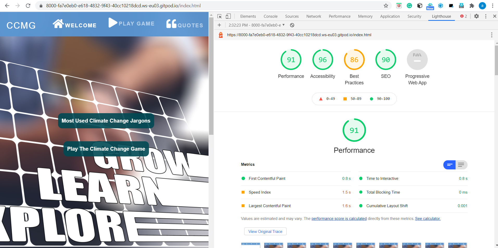

The results for mobile is 90%, although it is not terrible such a score but would strive to improve the score where needed to enhance it future performance. Below is the image from the mobile view.

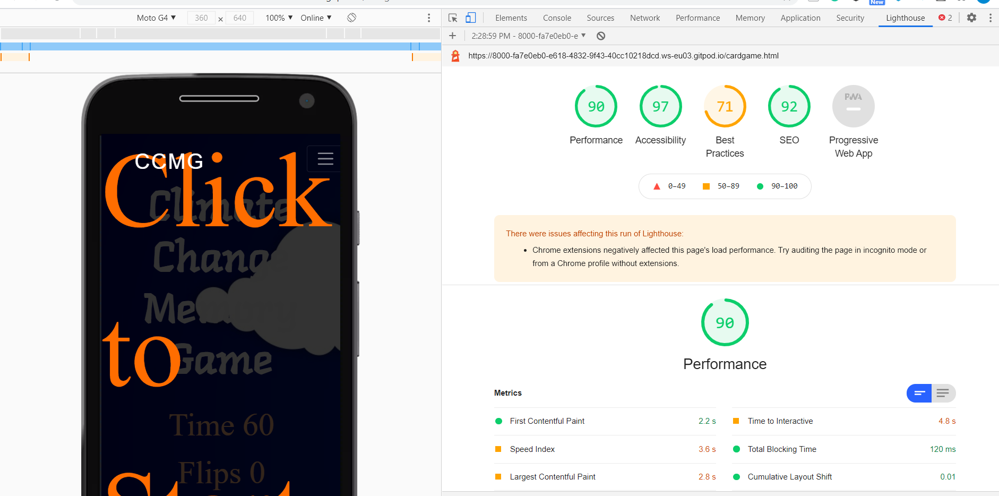

* Furthermore, the website was tested on the following: It works perfectly in them.

      * Systems: Macbook Pro Laptop, HP laptop, and Lenovo laptop.
      * Browsers: Chrome, Opera, Edge, Firefox, Safari
      * Phones and Tabs: iPad Pro, different Iphone series and androids

## **Testing user stories from UX section**

* As a user, I want to know the meaning of climate change.

    1. In the HOME PAGE just below the navigation bar.
    2. There is the article on Meaning of climate change. 
        

* As a visiting user, I want to know the meaning of the logo "CCMG".

    1. A user in the Home Page will see the logo at left corner of the header.
    2. When he/ she hovers cursor on the logo, it display Cimate Change Memory Game.
    3. CCMG is the acronym for  Cimate Change Memory Game.

* As a user, I want to play the available game online, also I want to see a brief instructions on how to play the game.

    1. Go to the Home page (or from any page).
    2. On the Navbar is the 'PlayGame' link and icon.
    3. On click shows Game instruction and the paly button.
    4. The play button goes to the game page directly. 

* As a potential user, I want to atleast read the instruction of the game from the Navigational bar and from the body of the site. 

    1. At the homepage, and just on the navigational bar is a link with an icon called "Play Game".
    .
    3. Onclick on the link the accordion will reveal two buttons, first one is the game instruction
    4. Also, within the body of the game, the green button which is called "Play the Climate Change Game" 
    onclick, it will reveal the instruction of the game.

* As a visiting user, I would want to know how to register with CCMG.

    1. At the Home Page, user will see navigation bar with several links.
    2. Within the navigation link, they can click on the "Sign UP" and it will open the modal form.
    3. The user can fill the form and submit it. 

* As a user, I want to read about the impact of climate change on humans and on the ecosystem.

    1. When the user arrives on the webpage, just within homepage, there is an article on Meaning of Climate Change and it Effect.          
    2. Beneath the first paragraph of the article is a green Read More button
    3. The text is hidden within the button, onclick it will open. 

* As a visiting user, I would want to know some climate Change terminologies to better understand climate change issues.

    1. At the homepage, just beneath the first article is are two green buttons with accordion.
    2. When a user click the first button to the left c"called Most Used Climate change Jargons, the accordion opens to reveal some climate change terminologies.

* As a user, I want to be able to connect to the game within the body without scrolling up to the navigation bar. 

    1. There is a second green button named "Play the Climate Change Game" and it is an accordion in the mainpage to the right. 
    2. When clicked, there are two contents, the instruction of the game and the play red button. ehrn clicked it takes the player to game page.

* As a user, I would want to know world leaders' views and some quotable quotes on climate change.

    1. When a user arrives on the webpage, he/she can see the navigation bar with several links  
    2. On the bar is Quote link and icon, when the user clicked on it, it scroll smoothly to the section.
    3. Also, the user can just scroll down the page just above the footer section are the quotes sliding carousel.
        

* The developer would want to be able to contact potential collaborators.
               
    1. When a customer arrives on the webpage, he/she can see the navigation bar with several links.
    2. The user can fill their data on the Sign up form at the navigation bar and submit.
    3. The developer can reach potential clients through their information submitted with the 
        form.
    

* As a developer, I want to provide my social media links so that users can follow my updates 
                
    1. When the user arrives on the webpage, the user can scroll down to the footer section.
    2. In the footer section the user will see the social media links for the business.

* As a developer, I want to be contatcted by potential user or client.

    1. When the user arrives on the webpage, he/she can see the navigation bar with several links.
    2. The user can either choose to contact us using the sign up form at the navigation bar.
    3. The customer can fill the form and submit it.
    4. Also, a user can just scroll down to the footer. Right there is our Phone, Email and Locations.

* As a user, I want to go back to the hompage from the game page.

    1. On the game page is the transparent navigational bar at the top.
    2. There is the CCMG logo, and the Welcome link and icon.
    3. A click on either of them will take you to homepage 
        

* As a user, I want to sign up directky from the game page without having going back to the homepage.

    1. On the game page is the transparent navigational bar at the top.
    2. There is the sign up red button to right top of the nav-bar.
    3. A click on it will open a model form over the page which you can fill and submit. 
        

## **Manual Testing**

#####  Home Page:

1. Navigation bar 

    1. At the Home Page on desktop. 
    2. Inspect links, and icons in the navigation menu to ensure they are well placed and they  
        are appearing correctly and centrally aligned on the navigation bar.
    3. Notice that the navbar is fixed so no matter where you are on the site you know where you are,
        one can click to access any any section.
    4. When move cursor over the logo "CCMG" it displayed the full name of site, that is, 
        Climate Change Memory Game.
    5. Check the links are in uppercase.
    6. Check the background color to be light blue and same for the footer.
    7. Check the fonts color and ensure they are white and same for the footer.
    8. When move the cursor over the icons to ensure they hovers and grow.
    9. When move the cursor over the green sign up button to the right, it hovers, grow and display expected red color.
    10. To test the smooth scroll and also to verify that the links are working do the following:

        (i)   Click on "WELCOME" link and verify that it stays on the HOME page
        (ii)  Click on "PLAY GAME" link and verify that the accordion opens and showing the "Game Instruction" and "Play" buttons
                * Onclick on the game instruction button, it opens model form over the page to reveal the instruction
                * onclick on the "Play" button, it goes to the Game page.
        (iii) Click on "QUOTE" link or icon and verify that it scrolls smoothly to the Quotes section.

        (vi)  Click on "Sign Up" link and verify that the modal form opens.

        **On the mobile view and medium device view**

        (a) Check to ensure that the navigation bar is responsive and all the icons and links collapsed 
            into the toggler icon.
        (b) Notice that the toggler icon is properly styled and at the right corner position.
        (c) Notice that all the icons are hidden, and that only the names of the links that appears 
            and they are centrally and vertically aligned.
        (d) Repeat steps (i) - (v) above for the mobile views
        (e) Check Jumbotron text in the home page and ensure the article is hidden for 
            the mobile device but displays in the medium device.
        (f) Notice that all the various sections are vertically align for the mobile view.
        (g) Check the the two green buttons are vertically aligned and the contents hidden and only appears onclick and the items are centrally aligned

2. **Welcome**

    1. Check the link directly stays on the home page. 
    2. Check the article heading on climate change is capitalized and bold.
    3. Check the heading and texts are centrally aligned in the page and the background color is black
        
    4. Check the text color is white.
    5. Ensure that the text are legible and centrally align. 
    6. Check the "Read More" button is working and the content therein is hidden and only revealed onclick.
    7. Check the the two green buttons below the jumbotron are centrally aligned to left and right and the contents hidden and only appears onclick and the items are centrally aligned
    8. Repeat this same steps on a mobile view, however, notice the jumbotron is hidden for mobile view and only green buttons that are centrally and vertically aligned.
    9. Also, inspect that all the various sections are vertically align for the mobile view and they 
        are responsives.

4. **Quote** 

    1. Scroll down to quote section or click on link in the  navigation bar on a desktop view.
    2. Check the quote heading is not bold, but capitalized and centrally aligned in the container.
    2. Inspect that the carousel is sliding perfectly.
    3. Check the slider that their are three images and quotes
    4. Check the slider indicators that are working and the previous and next button are
        functioning
    5. Repeat this same steps on a mobile view

6. **Footer**

    1. Scroll down to the footer section.
    2. Check that the background color is same as that of the theme of the Navigational bar.
    3. Check that all the contacts are there and the social links are working.
    4. Check that the content in the about section are aligned properly.
    5. Check the padding of the contents.
    6. Ensure when you hover on the social media icons they display red.
    7. Repeat this same steps on a mobile view.
    8. However, notice on mobile view that the location address does not appear.

### Game section

    1. On desktop, Notice the Navigational bar has similar feature as the hompage except the background color is transparent.
    2. Inspect links, and icons in the navigation menu to ensure they are well placed and they  
        are appearing correctly and centrally aligned on the navigation bar.
    3. Notice that the navbar is fixed so no matter where you are on the site you know where you are,
        one can click to access any any section.
    4. When move cursor over the logo "CCMG" it displayed the full name of site, that is, 
        Climate Change Memory Game.
    7. Check the fonts color and ensure they are white and same for the footer.
    8. When move the cursor over the icons, ensure they hovers and grow.
    9. When move the cursor over the to the red sign up button to the right, it hovers, and grow.
    10. To test the smooth scroll and also to verify that the links are working do the following:

        (i)   Click on "WELCOME" link and verify that it take you back to the HOME page
        (ii)  Click on "PLAY GAME" link and verify that the accordion opens and showing the "Game Instruction".
                
        (iii) Click on "QUOTE" link or icon and verify that it returns to the quote section in the homepage.

        (vi)  Click on the red "Sign Up" button and verify that the modal form opens.

        **On the mobile view and medium device view**

        (a) Check to ensure that the navigation bar is responsive and all the icons and links collapsed 
            into the toggler icon.
        (b) Notice that the toggler icon is properly styled and at the right corner position.
        (c) Notice that all the icons are hidden, and that only the names of the links that appears 
            and they are centrally and vertically aligned.
        (d) Repeat steps (i) - (v) above for the mobile views
                                 

2. **The Body and Game**

    1. On mobile view notice the game collapse into two columns, the cards appear in two columns. 
    2. Check the game title to text are vertically stacked over one another and they centrally aligned and the font is white in color.
    3. Also, inspect that all the various sections are vertically align for the mobile view and they are responsives.

6. **Footer**

    1. Scroll down to the footer section.
    2. Check that the background color is same as that of the theme of the Navigational bar.
    3. Check that all the contacts are there and the social links are working.
    6. Ensure when you hover on the social media icons they display red.
    7. Repeat this same steps on a mobile view.
    8. However, notice on mobile view that the location address does not appear and the content stacked vertically over one another.

## * The Game section*

### *Game Startup page*

 * The page loads with a ready-to-use display such as **Click to Start**. 
 * It has a slightly dark transparent overlay. Game starts on click and the timer starts counting down while the flip notes the number of flips the user makes. 
 * Since the aim of the game is to test user memory against the timer, the start click also starts the clock this is to maximize time. Below image is the start-up screen.

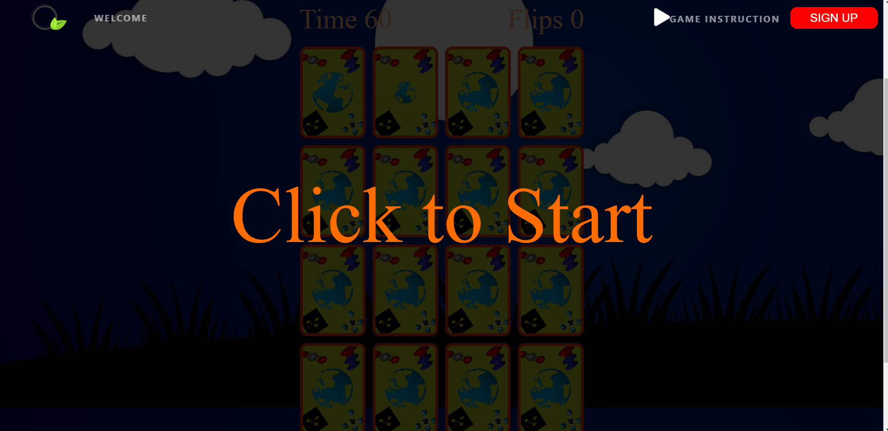

### *Active Game Mode and back of cards*

* The active view of the game has the game Title, Timer, flip counter, cards and background sound. Below is an image.
* The card images enlarge when player or user hovers over the back of the cards, it animates and grows toward the center of the card.
* The five images at the back of the card represent items which are very significant to climate change.
* In the following order: Top-Left-Right, Bottom-Right-Left and center, the images are Carbondioxide molecule (Co2), Nitrous oxide molecule N2O, methane molecule (CH4), chloroflourocarbon molecule (CFC) and image of the earth.
* Those images except that of the earth are gases that causes green-house-gas (GHG), which are the major anthropogenic factors that cause climate change
* All the images rotate clockwisely.
 
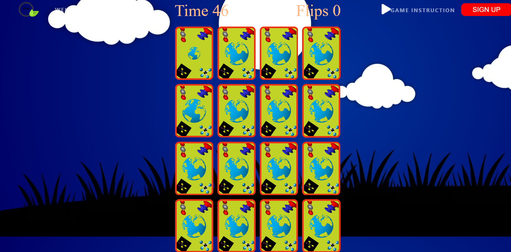

### *Front of cards*
 * When a user clicks on a card, it flips over and the cardfront view is displayed.
 * In the following order: Top-Left-Right, Bottom-Right-Left and center, the images are flood, desert, wildfire, emssions and lastly are the win-value images to be matched in the center and they are person cycling, vertical city, smartcity, urban farming, solar panel, windturbine, recycling, and tree planting.
* Those images except the ones at the center are the likely impact of climate change, while the ones in center are the likely mitigation and adaptation means to climate change.
* The card images enlarge when player or user hovers over the front of the cards, it animates and grows toward the center of the card.

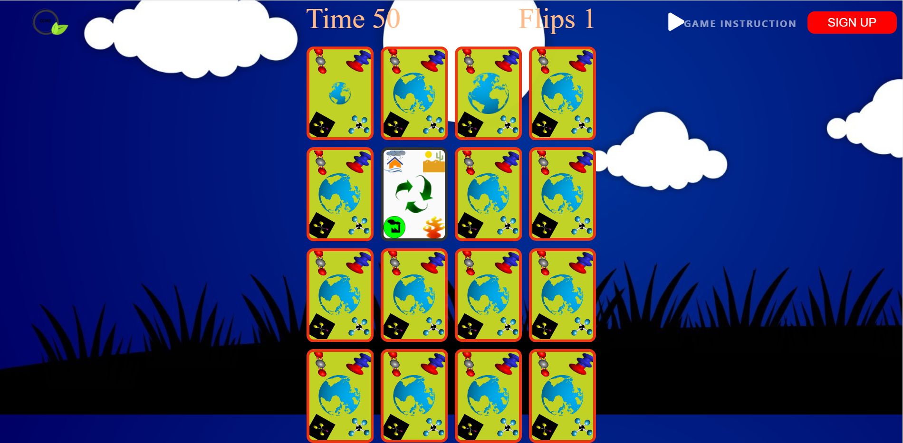

* When a user clicks, the flip sound could be heard.
* When a pair of cards matches on clicks, the cards will sway left to right in dancing animation and a clapping sounds and the matched cards remained face front.

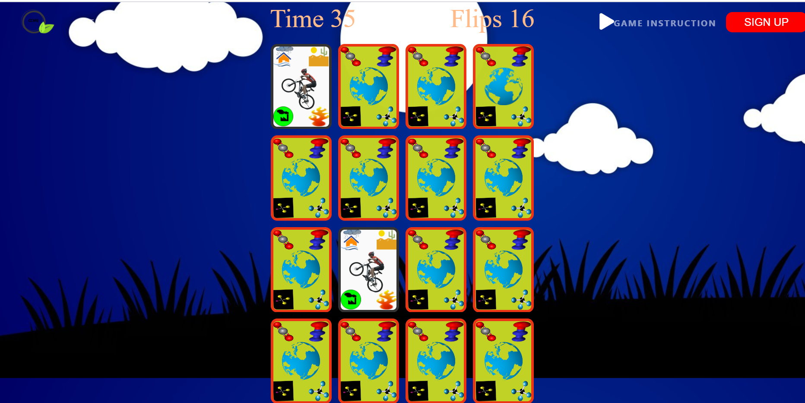

* If the pair of cards did not match both cards will display momentarily and then flip back to be hidden.

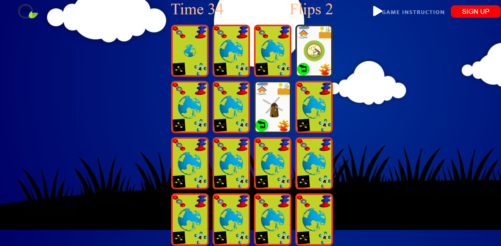

## *Game Over and victory mood*

* There are different displays when the game ends, loser and winner.
* The won game screen displays victory with a resounding victory sound and an overlayed click to restart.

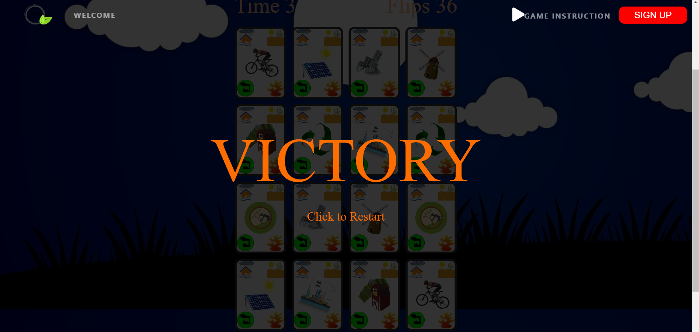

* The lost game screen displays game over with a melancholy sound, and an overlayed click to restart.

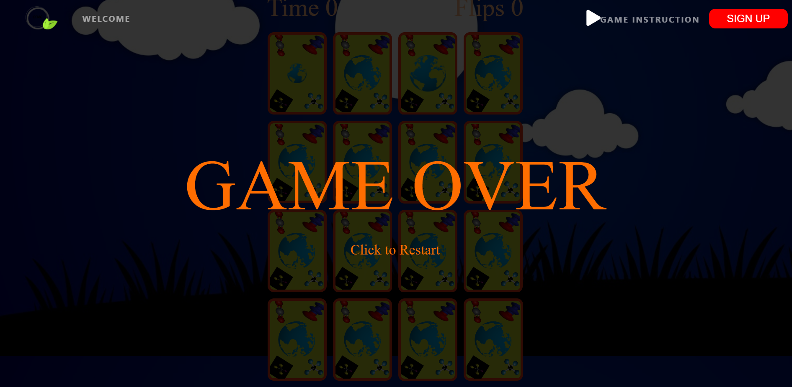

## Bugs and resolves

1. **Naviagational bar**
    * In the game section, the Naviagational bar overlaps the Timer and the flipper due to the height of the game container both on desktop and in mobile view.
    * In addition, in the mobile view of the game, the logo overlaps the timer and flip counter.

 ### Resolve
 * The issues was resolved by making the colour and footer of the game section transparent, also by changing the styling from justify-content-center to  justify-content: space-between;.
 * Lastly, on the mobile device the logo was hidden.

1. **Responsiveness**

* Intially, the following problems were identified
  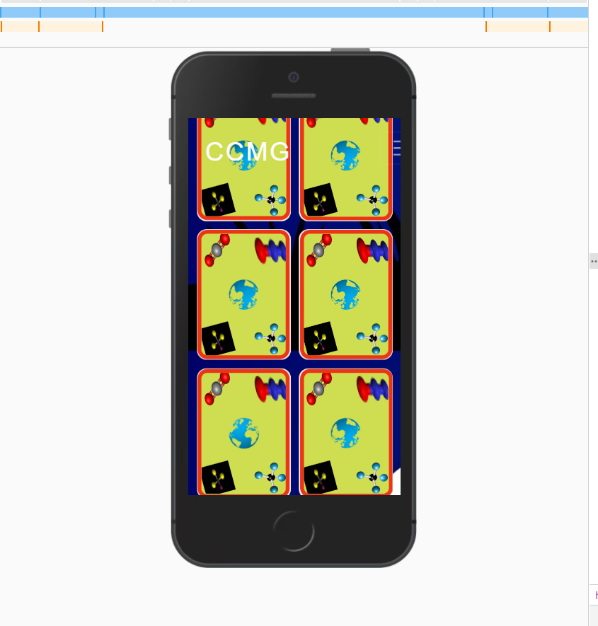

 * The 2 layout columns was not just good for the mobile view, it was not user-friendly, that was way code was initially built.
 length of card was just too long for media of 600px and below.

 ### Resolve

* The problem was resolve by applying media query of max-width 600px, and changing the layout into 4 columns.
* The method worked for all the small mobile devices except Iphone 5 series. Again, I had to apply another media query of max-width 350px. That resolve problems of Responsiveness and compactibility.
see here for the images [media@600](assets/testing/responsivecode2.png), and [media@600](assets/testing/responsivecode.png)

2. **Floating footer**

   * There was the footer problem that would not stick to the bottom. After doing lot of research by googling, and watching lot of youtube videos, finally there was solution after an interactive section with an online tutor.
    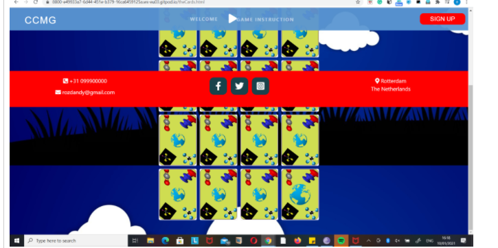

### Resolve

 * It was because I hard coded the footer height. I had to remove the height value for it to be resolve
    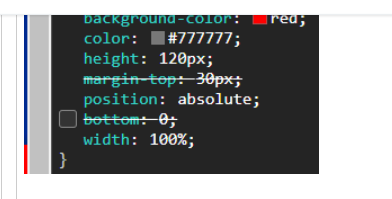

3. **Toggle Issue**

    * There was an issue of a button that has to be toggle twice before it reponded. The button was the Read More button in the centre of the jumbotron in the homepage. 
    * the major problem was because  <button class="btn btn-lg btn--cta btn--red hvr-grow-shadow read-moreButton expandToggle" onclick="readMore()">Read More..</button> the expandToggle class was used and also, in the Javascript the style was displayed none instead of block as can be seen in code below.
    {(var showContent = document.getElementById("showMoreContent1"); if (showContent.style.display === "none") )}

    

### Resolve 
* The class expandToggle was removed and the style-display was changed from none to block.

4. **Card White Background**
One bug that was lastly resolved was on the game's card background. When the cards flip, its background is white. the card is not supposed to have a white background when it flips, although when card flips completely , the white background does not show. I did lot of researches on it and almost gave up on it until the solution finaly. 

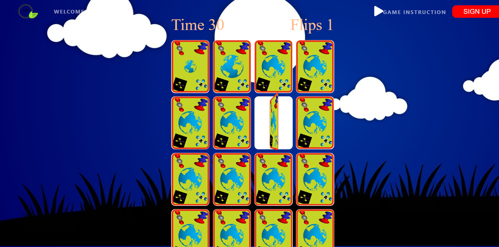

### Resolve 
* The simple solution is to set the cards' class background to transparent. [.card{ background-color: transparent; border-color: transparent;} ]

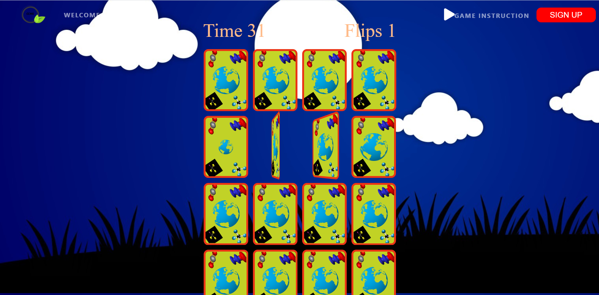

# **DEPLOYMENT**

## Deploying

The website was developed using both GitPod and using Git push to store them in GitHub, GitHub host the repository. The following steps weren used to deploy the site live using GitHub Pages:

* GitHub was  in the browser.
* Signed in with my username and password.
* Then choose “YOUR REPOSITORIES” from the dropdown’s
* Navigated to "ms2-project" and clicked and the project will opened in a new page.
* In the top navigation clicked settings.
* Scrolled down to the GitHub Pages area.
* Master Branch was selected from the Source dropdown menu.
* Clicked the save button to confirm.
* " ms2-project" became live on GitHub Pages.

## Clone

**How to clone / run this project locally, for other users**

1.	On GitHub, go to my Github page.
2.	Go to the repositories by clicking on the dropdown light-green button located at the far-right top.
3.  Then choose “YOUR REPOSITORIES” from the dropdown’s.
4.	At the repositories page, click on the title of the project “ms2-project”, the project will open in a new page.
5.  On the page and just above it is a Green button called "code", click on it to reveal the dropdown.
6.  Select and click "Download Zip" from the dropdown’s. The file will be downloaded on your local computer.
7.  Select the downloaded file on your local computer system, click on the file to extract.
8.  Click on the "index.html" link of the extracted file and site would be deployed.

# OR

1.	On GitHub, go to my Github page.
2.	Go to the repositories by clicking on the dropdown light-green button located at the far-right top.
3.	Then choose “YOUR REPOSITORIES” from the dropdown’s.
4.	At the repositories page, click on the title of the project “myfirst-miletone-project”
5.	Under the repository name, click Clone or download.
6.	In the Clone with HTTPs section, click to copy the clone URL for the repository.
7.	Open Githpod workspace, that is Git Bash.
8.	Using the command line, type git clone, and then paste the URL you copied in Step 6.
9.	Press Enter. Your local clone will be created.

# CREDITS

## contents

Logo: The site logo was created free from the below website;

    *https://www.freelogodesign.org/preview?lang=en&autodownload=true&logo=9ac215ca-c2a7-4428-a30d-7e6b875b17b6

**References:**

Sources of Articles: All the articles used in the site were obtained from the sites below;

    * https://www.nationalgeographic.com/environment/global-warming/global-warming-effects/

    * https://www.wwf.org.uk/learn/effects-of/climate-change

    * https://www.nrdc.org/stories/global-climate-change-what-you-need-know

    * https://givingcompass.org/partners/climate-action/10-important-climate-change-terms?gclid=Cj0KCQiA2af-BRDzARIsAIVQUOeQn_w_5-RDQ_o-zV_g1sR9gVtQh-jz3-dqQnDcBYYZxjAQYZS0x1MaAjHNEALw_wcB

    * https://climatechange.chicago.gov/climatechange/glossary-climate-change-terms

    * https://climaterealityproject.org/blog/key-terms-you-need-understand-climate-change

    * https://www.worldwildlife.org/threats/effects-of-climate-change

    *https://projectworldimpact.com/cause/Climate-Change-Effects?gclid=CjwKCAiA_9r_BRBZEiwAHZ_v18albsv2c_8ZvGiiOf2M9ueVIB4BvAd2BrEgYyvRs85aNujt_GKuIBoCvCgQAvD_BwE

    * https://warmheartworldwide.org/climate-change/?gclid=CjwKCAiA_9r_BRBZEiwAHZ_v16h8vtVOSHyhn3B0dFt-dzY7uhqCg3t6FiYCD5cajyGJoSefeUFHhRoCuosQAvD_BwE

* Sources of Quotes: https://www.climate-change-guide.com/quotes-on-climate-change.html

* Web Dev simplified AND PortEXE: These two videos were great source of inspirations to me, the thought of building the climate change memory game came to me after watching the two videos, thr tutorials helped in understanding JavaScript more and coding the game. See vidoe links below;
 https://www.youtube.com/watch?v=28VfzEiJgy4 and https://www.youtube.com/watch?v=3uuQ3g92oPQ&feature=youtu.be

## Media

All of the images in the site were supplied drom the sources below.

* Game background Image:
    *   https://www.pikrepo.com/fdabr/black-and-white-unk-text

* Quote image: 
  
    * https://www.pikrepo.com/fnuon/gray-curved-road-beside-arrow-left-signage-under-white-cloud-blue-skies#google_vignette
    * https://www.pikrepo.com/fomjf/brown-wooden-fence-near-trees-covered-in-snow
    * https://www.pikrepo.com/frdlf/red-leaf-tree-digital-wallpaper

* Game background Image:

   * https://pngtree.com/freebackground/sky-vector-background_1223263.html

* All the images used in building the game section except the background image was taken in this site 
    * https://www.pinclipart.com/
    * https://imgbin.com/download/vT7j663P

* All Sounds: 
   * https://www.freesfx.co.uk/Default.aspx

   * https://www.bensound.com/

* Web Dev simplified AND PortEXE: These two videos were great source of inspirations to me, the thought of building the climate change memory game came to me  after watching the two videos, thr tutorials helped in understanding JavaScript more and coding the game. See vidoe links below;
 https://www.youtube.com/watch?v=28VfzEiJgy4 and https://www.youtube.com/watch?v=3uuQ3g92oPQ&feature=youtu.be

**Miscellaneous**

The spinning effect of the back of my cards in the game section, code was lifted here: https://codepen.io/teerapuch/pen/vLJXeR 
 
 * The lecture videos and notes
 * [Stack overflow](https://stackoverflow.com/) To seek solutions to fix bugs.
 * [W3Schools](https://www.w3schools.com/) I used this site for references in many instances.

## Acknowledgements
I received inspiration for this project from:

    * God for Mercies.
    * Special to [PortEXE](https://www.youtube.com/watch?v=3uuQ3g92oPQ) and [PortEXE](https://www.youtube.com/watch?v=28VfzEiJgy4) for the tutorial.
    * My mentor for advice and feedback.
    * Student care and student tutors for being there when I needed them most.